# [2] Limo Pro 기초

- 2026년 06월 23일 (화) 교육 자료
- Limo Pro의 기초 사용법 숙지
- [Limo Pro 메뉴얼](https://goofy-pleasure-a84.notion.site/Limo-Wiki-a6aa65b627cb40019a82d469dc5ae69d?pvs=4)

## 2.1. 원격 접속

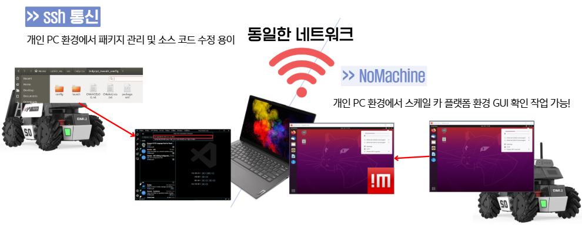

### 2.1.1 vscode (ssh)

1. Remote Development 설치

   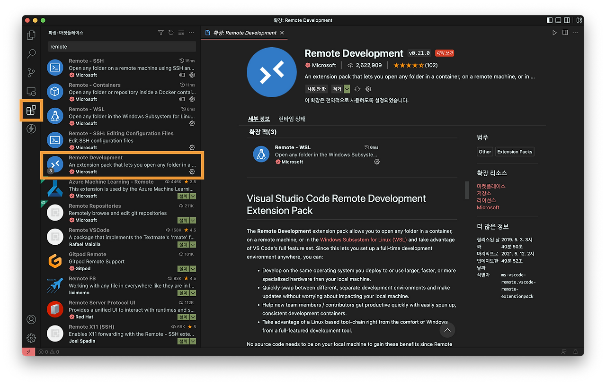

2. 원격 탐색기 - ssh 대상 - 추가(+) → ssh 접속 명령어 입력 → 패스워드 입력  

   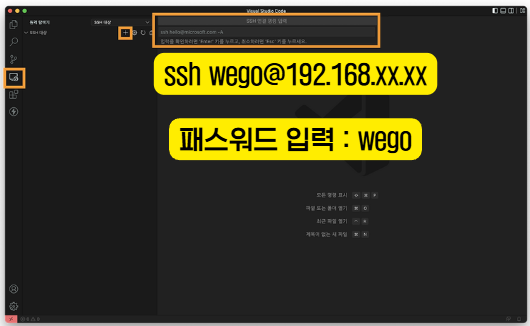

3. 탐색기 - 폴더 열기

   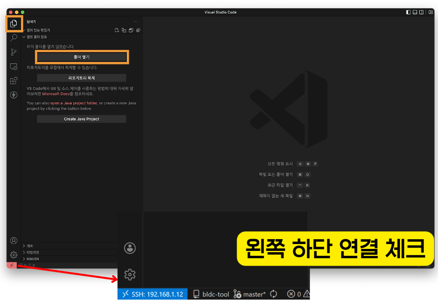

4. 패키지 작업 진행(코드 작성 / 터미널 실행)  
   
    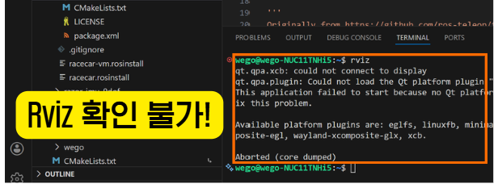

## 2.1.2. NoMachine

1. NoMachine 설치  
2. 자동 검색으로 나오면 바로 접속  
3. 안 나오는 경우 Add 클릭 \- Add Connection  

   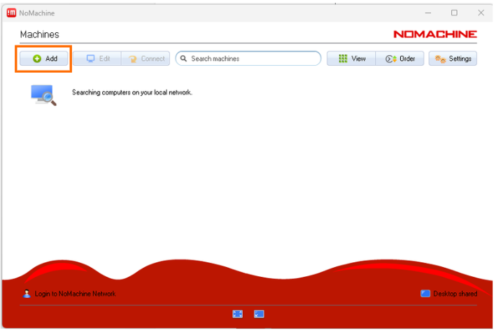

4. Name(아무거나), Host(IP 주소) 작성  

   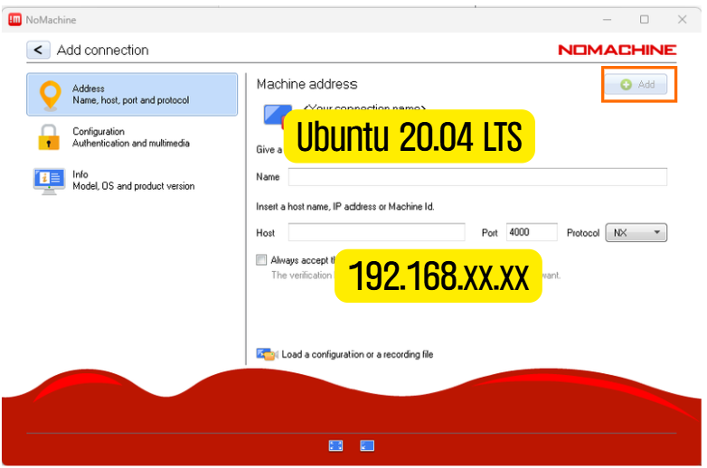  
   
5. 접속(Verify host identification 뜰 시 OK 클릭)  

   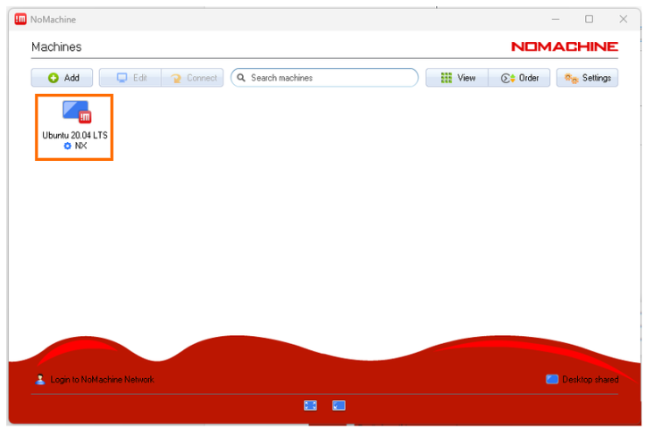

6. ubuntu 아이디 및 패스워드 입력 후 접속  

   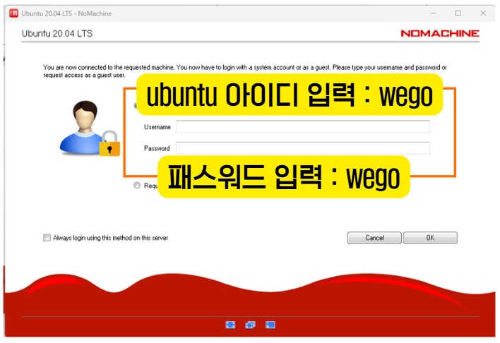  

## 2.2. LIMO Pro Description

## 2.2.1 Package

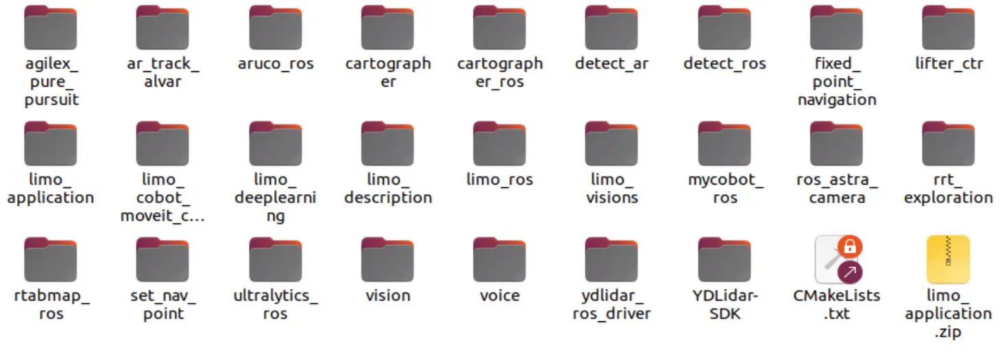

## 2.2.2 센서 Topic

| 센서 / 모터 | 토픽 | 용도 |
| :---- | :---- | :---- |
| Orbbec Dabai | `/camera/color/image_raw/compressed` | 차선/신호등 인식 |
| YDLidar Tmini | `/scan` | 장애물 감지 |
| limo\_base 내장 (HII226) | `/imu` | 회전 각도 측정 |
| limo\_base | `/cmd_vel` | 모터 제어 |

## 2.2.3 Bringup

* Lidar 구동

```shell
roslaunch ydlidar_ros_driver Tmini.launch
```

* Camera 구동

```shell
roslaunch astra_camera dabai_u3.launch
```

* IMU, Motor 구동

```shell
roslaunch limo_base limo_base.launch
```

* 전체 구동(Lidar, IMU, Motor 구동) \- Camera 추가 필요

```shell
roslaunch limo_bringup limo_start.launch
```

## 2.3. Packge 구성과 launch 파일 생성

## 2.3.1 Package 구조화

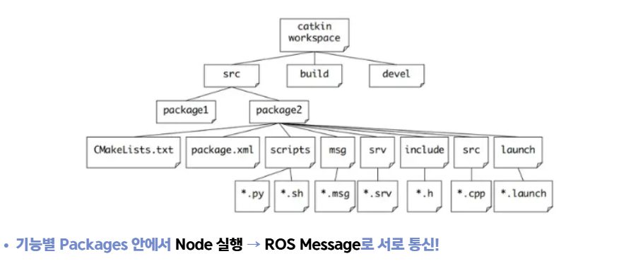

* 스스로 구분하기 쉽게 package를 구성

EX) 각 종 센서 패키지 구동을 한번에 실행하기 \= limo\_bringup 패키지 **limo\_start.launch**

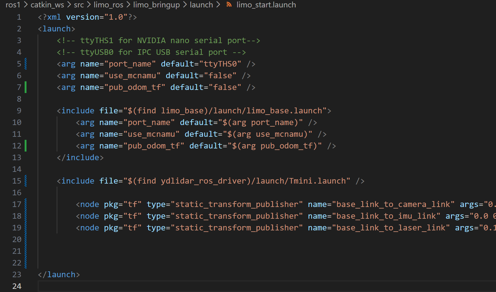

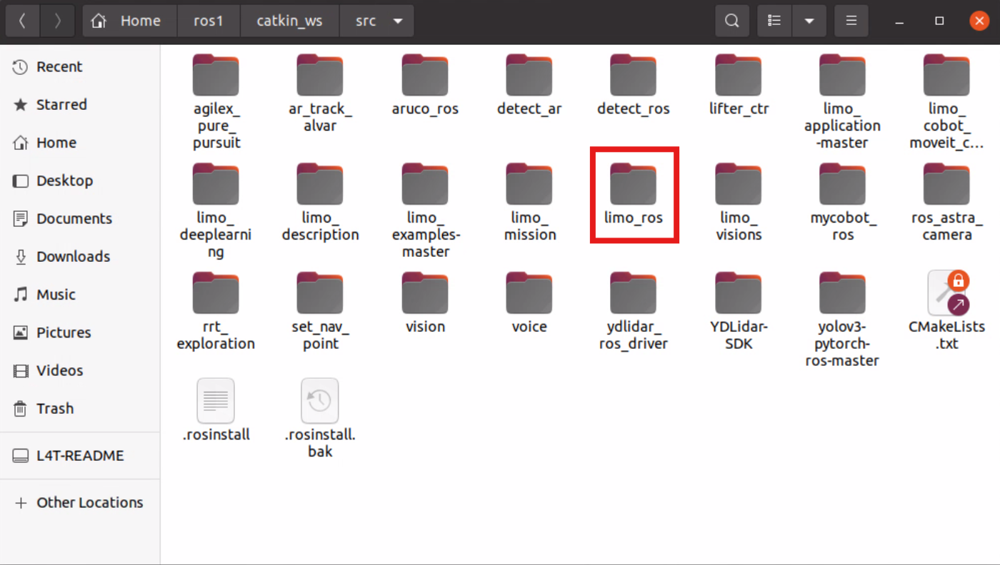

* cfg, include, launch, params, scripts 등등

## 2.3.2 Launch 파일

* Launch \= 여러 개의 Node와 설정을 한 번에 켜고 관리하는 파일

    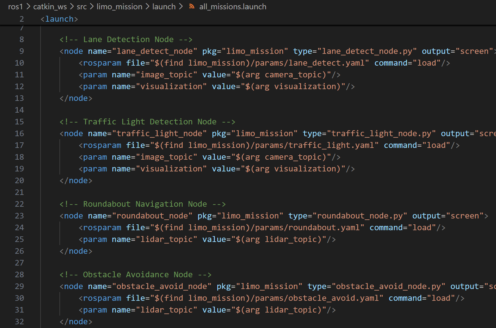

**위 파일은 자체 제작한 node를 같이 실행해주는 launch 파일**

* 간단하게 표현하자면 rosrun을 한꺼번에 해줄 수 있다.  

  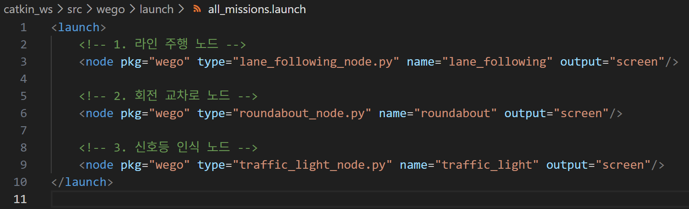  
    
    * pkg : 패키지 이름  
    * type : 실행 파일 이름  
    * name : 이 노드의 이름  
    * output=”screen” : 터미널에 로그 출력
