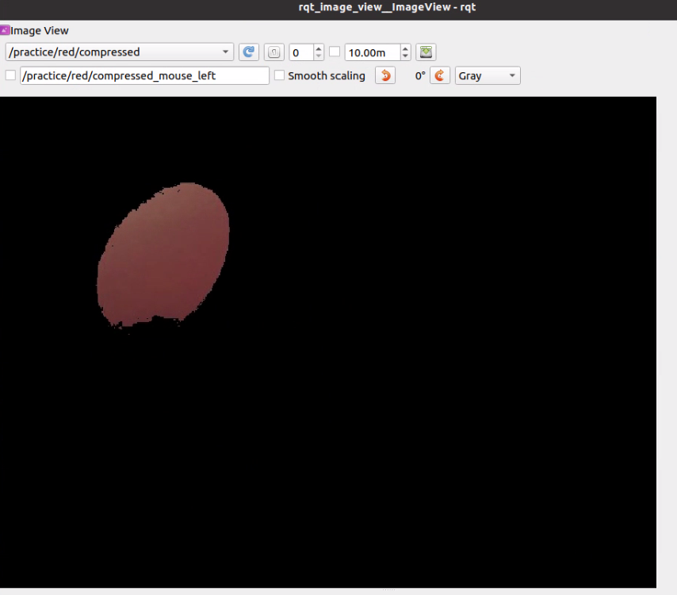
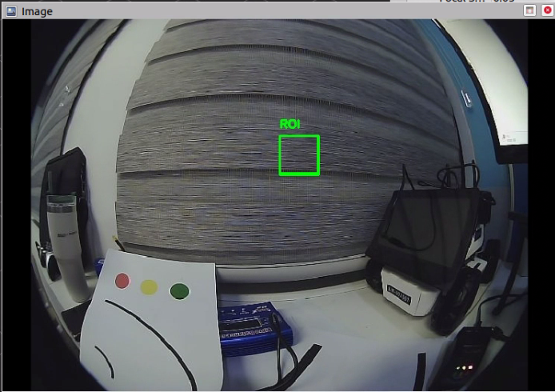

# \[5\] 미션 관련 실습

## 5.1 Camera

### 5.1.1 OpenCV를 활용하여 색깔 구별

```py
#!/usr/bin/env python3
# -*- coding: utf-8 -*-

import rospy
import cv2
import numpy as np
from sensor_msgs.msg import CompressedImage

# ========================================
# HSV 임계값 설정
# ========================================
B_LOW = (100, 100, 100)
B_HIGH = (150, 255, 255)
G_LOW = (30, 80, 80)
G_HIGH = (90, 255, 255)
R_LOW = (0, 100, 100)
R_HIGH = (30, 255, 255)
R2_LOW = (150, 100, 100)
R2_HIGH = (180, 255, 255)


# Publisher (전역)
pub_original = None
pub_blue = None
pub_green = None
pub_red = None


def publish_image(publisher, img):
    """이미지를 CompressedImage로 발행"""
    msg = CompressedImage()
    msg.header.stamp = rospy.Time.now()
    msg.format = "jpeg"
    msg.data = np.array(cv2.imencode('.jpg', img)[1]).tobytes()
    publisher.publish(msg)


def image_callback(msg):
    """이미지 콜백"""
    np_arr = np.frombuffer(msg.data, np.uint8)
    img = cv2.imdecode(np_arr, cv2.IMREAD_COLOR)
   
    if img is None:
        return
   
    # BGR → HSV 변환
    hsv = cv2.cvtColor(img, cv2.COLOR_BGR2HSV)
   
    # 각 색상 마스크 생성
    b_mask = cv2.inRange(hsv, B_LOW, B_HIGH)
    g_mask = cv2.inRange(hsv, G_LOW, G_HIGH)
    r_mask1 = cv2.inRange(hsv, R_LOW, R_HIGH)
    r_mask2 = cv2.inRange(hsv, R2_LOW, R2_HIGH)
    r_mask = cv2.bitwise_or(r_mask1, r_mask2)
   
    # 마스크 적용
    blue_img = cv2.bitwise_and(img, img, mask=b_mask)
    green_img = cv2.bitwise_and(img, img, mask=g_mask)
    red_img = cv2.bitwise_and(img, img, mask=r_mask)
   
    # 발행
    publish_image(pub_original, img)
    publish_image(pub_blue, blue_img)
    publish_image(pub_green, green_img)
    publish_image(pub_red, red_img)


def main():
    global pub_original, pub_blue, pub_green, pub_red
   
    rospy.init_node('color_filter')
   
    # Publisher 설정
    pub_original = rospy.Publisher('/practice/original/compressed', CompressedImage, queue_size=1)
    pub_blue = rospy.Publisher('/practice/blue/compressed', CompressedImage, queue_size=1)
    pub_green = rospy.Publisher('/practice/green/compressed', CompressedImage, queue_size=1)
    pub_red = rospy.Publisher('/practice/red/compressed', CompressedImage, queue_size=1)
   
    # Subscriber 설정 (LIMO Pro 카메라 토픽)
    rospy.Subscriber('/camera/color/image_raw/compressed', CompressedImage, image_callback, queue_size=1)
   
    rospy.loginfo("=" * 50)
    rospy.loginfo("HSV 색상 분리 시작!")
    rospy.loginfo("rqt_image_view에서 /practice/xxx/compressed 확인")
    rospy.loginfo("=" * 50)
   
    rospy.spin()


if __name__ == '__main__':
    main()

```



* /practice/red/compressed를 따로 publish하여 확인

```shell
roslaunch astra_camera dabai_u3.launch
rosrun <your_package_name> <your_code_name>.py
rqt_image_view #rviz에서 Add로 확인 가능  
```

### 5.1.2 Camera 인식 범위 설정(ROI)

```py
#!/usr/bin/env python3
# -*- coding: utf-8 -*-


import rospy
import cv2
import numpy as np
from sensor_msgs.msg import CompressedImage


ROI_X = 320
ROI_Y = 150
ROI_W = 50
ROI_H = 50


# Publisher (전역)
pub_roi = None


def publish_image(publisher, img):
    """이미지를 CompressedImage로 발행"""
    msg = CompressedImage()
    msg.header.stamp = rospy.Time.now()
    msg.format = "jpeg"
    msg.data = np.array(cv2.imencode('.jpg', img)[1]).tobytes()
    publisher.publish(msg)


def image_callback(msg):
    """이미지 콜백"""
    np_arr = np.frombuffer(msg.data, np.uint8)
    img = cv2.imdecode(np_arr, cv2.IMREAD_COLOR)
   
    if img is None:
        return
   
    # ROI 지정
    roi = img[ROI_Y:ROI_Y+ROI_H, ROI_X:ROI_X+ROI_W]
   
    # ROI 영역에 사각형 그리기
    cv2.rectangle(roi, (0, 0), (ROI_W-1, ROI_H-1), (0, 255, 0), 2)
   
    # 원본 이미지에도 ROI 위치 표시
    cv2.rectangle(img, (ROI_X, ROI_Y), (ROI_X+ROI_W, ROI_Y+ROI_H), (0, 255, 0), 2)
    cv2.putText(img, "ROI", (ROI_X, ROI_Y-10), cv2.FONT_HERSHEY_SIMPLEX, 0.5, (0, 255, 0), 2)
   
    # 발행
    publish_image(pub_roi, img)


def main():
    global pub_roi
   
    rospy.init_node('roi_example')
   
    # Publisher 설정
    pub_roi = rospy.Publisher('/practice/roi/compressed', CompressedImage, queue_size=1)
   
    # Subscriber 설정 (LIMO Pro 카메라 토픽)
    rospy.Subscriber('/camera/color/image_raw/compressed', CompressedImage, image_callback, queue_size=1)
   
    rospy.loginfo("=" * 50)
    rospy.loginfo("ROI 설정 예제")
    rospy.loginfo(f"ROI: x={ROI_X}, y={ROI_Y}, w={ROI_W}, h={ROI_H}")
    rospy.loginfo("rqt_image_view에서 /practice/roi/compressed 확인")
    rospy.loginfo("=" * 50)
   
    rospy.spin()


if __name__ == '__main__':
    main()
```



* /pratice/roi/compressed를 따로 publish하여 확인

## 5.2 Lidar

### 5.2.1 Lidar 거리 인식 별 모터 속도 조절

```py
#!/usr/bin/env python3
# -*- coding: utf-8 -*-

import rospy
import numpy as np
from sensor_msgs.msg import LaserScan
from geometry_msgs.msg import Twist


TARGET_DISTANCE = 0.3   # 목표 거리 (m)
STOP_DISTANCE = 0.15    # 정지 거리 (m)
NORMAL_SPEED = 0.5      # 정상 속도 (m/s)
SLOW_SPEED = 0.2        # 감속 속도 (m/s)
FRONT_WINDOW = 50       # 전방 감지 범위 (포인트 수)


# Publisher (전역)
drive_pub = None


def scan_callback(msg):
    """LiDAR 콜백"""
    ranges = np.array(msg.ranges)
    total = len(ranges)
   
    # LIMO Pro YDLidar: -180도 ~ +180도 스캔
    # 인덱스 중간(center)이 전방(0도)
    center = total // 2
    half_window = FRONT_WINDOW // 2
    front_start = max(0, center - half_window)
    front_end = min(total, center + half_window)
    front_ranges = ranges[front_start:front_end]
   
    # 최소 거리 계산 (0이나 무한대 제외)
    valid = front_ranges[(front_ranges > 0.01) & (front_ranges < 10.0)]
   
    if len(valid) == 0:
        min_dist = 10.0
    else:
        min_dist = np.min(valid)
   
    # 속도 결정
    if min_dist < STOP_DISTANCE:
        speed = 0.0
        status = "STOP"
    elif min_dist < TARGET_DISTANCE:
        speed = SLOW_SPEED
        status = "SLOW"
    else:
        speed = NORMAL_SPEED
        status = "GO"
   
    # 명령 발행 (LIMO Pro는 Twist 사용)
    cmd = Twist()
    cmd.linear.x = speed
    cmd.angular.z = 0.0
    drive_pub.publish(cmd)
   
    # 터미널 출력
    rospy.loginfo_throttle(0.3, f"전방: {min_dist:.2f}m | {status} | {speed:.1f}m/s")


def main():
    global drive_pub
   
    rospy.init_node('lidar_follow')
   
    # Publisher 설정 (LIMO Pro 모터 명령 토픽)
    drive_pub = rospy.Publisher('/cmd_vel', Twist, queue_size=1)
   
    # Subscriber 설정 (LIMO Pro LiDAR 토픽)
    rospy.Subscriber('/scan', LaserScan, scan_callback, queue_size=1)
   
    rospy.loginfo("=" * 50)
    rospy.loginfo("LiDAR 거리 유지 시작!")
    rospy.loginfo(f"목표 거리: {TARGET_DISTANCE}m, 정지 거리: {STOP_DISTANCE}m")
    rospy.loginfo("=" * 50)
   
    rospy.spin()

if __name__ == '__main__':
    main()


```
